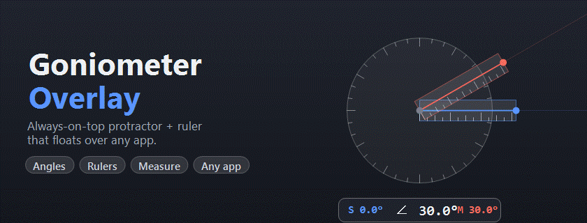

# Goniometer Overlay



A lightweight, **always-on-top goniometer** — an old-school protractor with two
hinged, graduated ruler arms — that floats on top of everything else on your
screen. Position it over your work, set an angle or measure a distance, and use
the on-screen guide rays as a visual reference **while you keep working in any
other application**.

The overlay is always visible but never in the way: clicks pass straight through
to the app underneath, except on the goniometer itself.

> **Platforms:** Windows 10/11 (x64) and macOS 12+ (Apple Silicon + Intel).

---

## ✨ Features

- **Floats over any app** — transparent, always-on-top overlay on every display; clicks pass through except on the goniometer.
- **Two rotatable arms** with infinite guide rays out to the screen edges.
- **Live angle readout** — each arm's absolute angle plus the angle **between** them (0–180°).
- **Type an exact angle** — click a readout value and enter the arm angle directly.
- **Ruler modes** — draw the arms as physical rulers graduated in **centimetres, inches, or pixels**; metric/imperial reflect real on-screen size (with calibration).
- **Direct measurement mode** — click-drag to measure distance along a ruler, a swept angle on the dial, or a radius from the center.
- **Angle snapping** — snap to a step (0.5° / 1° / 5° / 15°) or drag freely; hold **Shift** for 15°, **Alt** for free.
- **Lock mode** — make the overlay fully click-through so you can reference it while working underneath.
- **Adjustable** opacity and dial size; **follows your OS light/dark theme**.
- **Global hotkeys** and a **tray / menu-bar icon** for quick control.
- **Remembers your setup** — position, size, angles, mode, and settings persist across restarts (per display).

---

## 📥 Install

### Windows
1. Download an app from the [**Releases**](https://github.com/JianZhongDev/OldSchoolGoniometerDesktopApp/releases) page:
   - **`Goniometer Overlay Setup <version>.exe`** — installer (adds Start-menu + desktop shortcuts), **or**
   - **`Goniometer Overlay <version>.exe`** — portable (runs directly, no install).
2. Run it.
   > ⚠️ These builds aren't code-signed yet, so Windows SmartScreen shows *"Windows
   > protected your PC"* on first launch. Click **More info → Run anyway**. After
   > that the app works fully.
3. There's **no window to close** — the app lives in the **system tray** (protractor icon). Quit from there, from the **✕** button on the on-screen panel, or with **Ctrl + Shift + Q**.

### macOS

1. Download **`Goniometer Overlay <version>-universal.dmg`** from the
   [**Releases**](https://github.com/JianZhongDev/OldSchoolGoniometerDesktopApp/releases)
   page (a universal build — runs on both Apple Silicon and Intel).
2. Open the `.dmg` and drag the app into **Applications**.
3. Get past Gatekeeper (needed **once** — see [Why this is needed](#why-the-extra-steps-on-macos) below), then the app runs in the **menu bar** (no dock icon). Quit from there, from the **✕** button on the on-screen panel, or with **Cmd + Shift + Q**.

#### Getting past Gatekeeper (first launch only)

Because this build isn't yet signed/notarized (see below), macOS blocks it on first launch. Use **Method A**; if the app still won't open (e.g. you see *"is damaged and can't be opened"*), use **Method B**.

**Method A — System Settings (no Terminal)** — Apple's supported way to run an app from an unidentified developer:

1. Double-click the app once. macOS shows a warning and refuses to open it — that's expected; click **Done**.
2. Open  → **System Settings** → **Privacy & Security**, scroll to the **Security** section.
3. You'll see *"Goniometer Overlay was blocked to protect your Mac."* Click **Open Anyway**.
4. Confirm with **Open Anyway**, then authenticate with your login password / Touch ID.

   > The **Open Anyway** button only appears for about an hour after you try to
   > open the app, and it grants a permanent per-app exception, so you won't need
   > to repeat this. See Apple's guide:
   > [Open a Mac app from an unknown developer](https://support.apple.com/guide/mac-help/open-a-mac-app-from-an-unknown-developer-mh40616/mac).

**Method B — Terminal (fallback)** — if Method A doesn't clear it, remove the download-quarantine flag macOS attached to the file, then open normally:

```bash
xattr -dr com.apple.quarantine "/Applications/Goniometer Overlay.app"
```

(Adjust the path if you put the app elsewhere. `-d` deletes the attribute, `-r` recurses into the app bundle. Add `sudo` in front only if it reports *permission denied*.) After this, open the app from Applications as usual. This is the same thing Method A does, just done directly to the file.

> **Only run these steps for apps you trust** — they intentionally lower a macOS
> security check. Apple notes that overriding Gatekeeper is a common way Macs get
> infected, so don't apply these to software from sources you don't recognize.

#### Why the extra steps on macOS?

The app is **not code-signed or notarized yet** (that requires a paid Apple Developer account). macOS's Gatekeeper blocks unsigned apps downloaded from the internet by default and tags them with a "quarantine" flag, which is what produces the *"cannot be checked for malicious software"* / *"is damaged"* messages. The steps above tell macOS to trust this specific app once; nothing about the app itself changes. A future signed + notarized build will remove these steps entirely.

---

## 🚀 Quick start (usage)

The overlay shows the dial, two arms, and **one control panel just below the
dial** — the angle readout on top, buttons beneath.

**Readout:** `S <blue°>   ∠ <between°>   M <red°>`
- **S** = stationary (blue) arm angle, **M** = moving (red) arm angle, **∠** = angle between them.
- **Click the underlined S or M** to type that arm's exact angle (Enter to apply, Esc to cancel).

**Buttons:**

| Button | What it does |
|---|---|
| **Lines / Metric / Imperial / Pixels** | Switch how the arms are drawn (lines vs. graduated rulers). |
| **Snap N° / Free** | Toggle angle snapping (step set in ⚙). |
| **📏 Measure** | Turn on measurement mode (see below). |
| **🔓 / 🔒** | Lock — makes the overlay click-through so you can use the app underneath. |
| **⚙** | Settings: opacity, dial size, snap step, ruler calibration. |
| **✕** | Quit. |

**Mouse (normal mode):**

| Do this | To… |
|---|---|
| Drag the center dot or dial | Move the whole goniometer |
| Drag a blue/red arm handle | Rotate that arm |
| Hold **Shift** / **Alt** while rotating | Snap to 15° / rotate freely |
| Mouse-wheel over the dial | Resize the dial (80–400 px) |

**Measurement mode (📏)** — click-drag on the goniometer, click again to clear:
- along a **ruler edge** → distance along the ruler,
- on the **dial face** → swept angle,
- from the **center** outward → radius.
Distances use the current unit (cm / in / px).

**Global keyboard shortcuts** (work even when another app is focused):

| Shortcut | Action |
|---|---|
| `Ctrl/Cmd + Shift + P` | Show / hide the overlay |
| `Ctrl/Cmd + Shift + L` | Lock / unlock |
| `Ctrl/Cmd + Shift + C` | Copy the current angle to the clipboard |
| `Ctrl/Cmd + Shift + Q` | **Quit** (works even if the UI ever freezes) |

> **Tip:** angles use the standard math convention — **0° = right (east)**,
> increasing **counter-clockwise** (90° up, 180° left, 270° down).

---

## 🛠 Build from source

Requires [Volta](https://volta.sh) (pins Node 20.18.0 / npm 10.8.2 automatically).

```bash
# Windows: winget install Volta.Volta   |   macOS: curl https://get.volta.sh | bash
cd Source
npm ci          # exact, isolated install — no global packages
npm run dev     # launch the overlay in development
```

Package installers locally (each platform must be built **on that platform**):

```bash
npm run package:win     # → Apps/  (NSIS installer + portable .exe)   [on Windows]
npm run package:mac     # → Apps/  (universal .dmg)                    [on macOS]
```

Or just **push a version tag** — GitHub Actions builds *both* platforms and
attaches the installers to a Release (no Mac of your own needed for the `.dmg`):

```bash
git tag v1.2.3 && git push origin v1.2.3
```

> Detailed build notes, architecture, and every gotcha are documented for
> maintainers/agents in [`Agents/PROJECT_GUIDE.md`](Agents/PROJECT_GUIDE.md).

---

## 🧱 Tech

Electron 31 · TypeScript 5 · electron-vite 2 · electron-store · electron-builder.
**No UI framework** — the entire interface is one inline SVG plus a small HTML
control panel. Source lives in [`Source/`](Source); the product spec is in
[`Planning/`](Planning).

---

## 📄 License

See [LICENSE](LICENSE).
